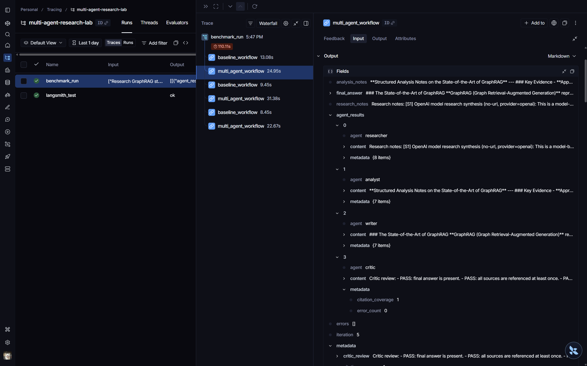

# Multi-Agent Research Lab

**Tên:** Bùi Trần Gia Bảo  
**Mã HV:** 2A202600009

This lab implements a multi-agent research assistant. It compares a single-agent baseline against a supervised multi-agent workflow and automatically produces trace files plus a benchmark report.

## What was implemented

### 1. Single-agent baseline

Implemented in `src/multi_agent_research_lab/cli.py`.

The baseline path performs the whole task in one flow:

1. Accept a user query.
2. Ask the research/search client for an OpenAI-backed research source.
3. Build a source-indexed prompt.
4. Call the LLM client to write the answer.
5. Store the final answer, source list, metadata, and trace event in `ResearchState`.

### 2. Multi-agent workflow

Implemented mainly in:

```text
src/multi_agent_research_lab/graph/workflow.py
src/multi_agent_research_lab/agents/
```

The intended route is:

```text
Supervisor -> Researcher -> Supervisor -> Analyst -> Supervisor -> Writer -> Supervisor -> Critic -> Supervisor -> Done
```

| Agent      | File                   | Responsibility                                                                                   |
| ---------- | ---------------------- | ------------------------------------------------------------------------------------------------ |
| Supervisor | `agents/supervisor.py` | Chooses the next worker, records route history, and stops when the workflow is complete.         |
| Researcher | `agents/researcher.py` | Calls the search client, stores source records, and writes source-indexed research notes.        |
| Analyst    | `agents/analyst.py`    | Uses the LLM client to turn research notes into evidence, gaps, risks, and writing guidance.     |
| Writer     | `agents/writer.py`     | Uses the LLM client to produce the final markdown answer with source IDs and limitations.        |
| Critic     | `agents/critic.py`     | Bonus validation step that checks final answer presence, citation coverage, and workflow errors. |

### 3. OpenAI LLM integration

Implemented in `src/multi_agent_research_lab/services/llm_client.py`.

Behavior:

- Uses `OPENAI_MODEL` from `.env`; the model is not hard-coded in the agents.
- The intended lab model is:

```env
OPENAI_MODEL=gpt-4.1-nano
```

- Calls the OpenAI Responses API when the SDK supports it.
- Falls back to Chat Completions only if the installed SDK does not expose `client.responses`.
- Records provider, model, input tokens, output tokens, estimated cost, latency, and fallback status.
- Uses deterministic local fallback only when OpenAI cannot be used, for example missing API key, missing SDK package, provider error, or explicit `LLM_PROVIDER=local`.

### 4. Research/search integration

Implemented in `src/multi_agent_research_lab/services/search_client.py`.

Behavior:

- Does **not** search the local repository documents.
- Default mode is `OPENAI_SEARCH_MODE=model`, which makes a normal OpenAI model call for the Researcher step. This mode works with `gpt-4.1-nano` and avoids rejected hosted web-search tool calls.
- Optional mode is `OPENAI_SEARCH_MODE=web`, which attempts OpenAI hosted `web_search` using the configured search model.
- If hosted web search fails, the client falls back to model-only OpenAI research and records the limitation in source metadata.
- If OpenAI cannot be called at all, the client returns an explicit fallback source and does not pretend external research succeeded.

Recommended `.env` for this lab:

```env
OPENAI_SEARCH_MODE=model
OPENAI_SEARCH_MODEL=gpt-4.1-nano
```

### 5. Shared state

Implemented in `src/multi_agent_research_lab/core/state.py`.

`ResearchState` is the shared handoff object. It stores:

- original request,
- iteration count,
- route history,
- sources,
- research notes,
- analysis notes,
- final answer,
- agent results,
- trace events,
- errors,
- metadata such as completion status and critic review.

### 6. Guardrails and fallbacks

| Guardrail or fallback | Where                                                         | Behavior                                                                                              |
| --------------------- | ------------------------------------------------------------- | ----------------------------------------------------------------------------------------------------- |
| Max iterations        | `agents/supervisor.py`, `graph/workflow.py`, `core/config.py` | Prevents infinite routing. If no final answer exists at the limit, the workflow uses writer fallback. |
| Timeout               | `graph/workflow.py`, `core/config.py`                         | Checks elapsed wall-clock time before each routed step.                                               |
| Retry                 | `graph/workflow.py`                                           | Each worker gets two attempts before fallback.                                                        |
| Search fallback       | `services/search_client.py`, `agents/researcher.py`           | Does not invent sources. Records a fallback source if OpenAI search/research fails or cannot run.     |
| Analyst fallback      | `agents/analyst.py`, `graph/workflow.py`                      | Records missing research and writes limited-evidence analysis guidance.                               |
| Writer fallback       | `agents/writer.py`, `graph/workflow.py`                       | Writes a guarded final answer that does not add facts beyond available state.                         |
| Critic fallback       | `graph/workflow.py`                                           | Records unavailable critic review if critic fails after retries.                                      |
| Validation            | `agents/critic.py`                                            | Checks answer presence, citation coverage, and workflow errors.                                       |
| Traceability          | `core/state.py`, `observability/tracing.py`                   | Records route decisions, agent spans, fallback events, errors, and completion.                        |

### 7. Benchmark and automatic report

Implemented in:

```text
src/multi_agent_research_lab/evaluation/benchmark.py
src/multi_agent_research_lab/evaluation/report.py
src/multi_agent_research_lab/services/storage.py
```

The benchmark command runs every query in `configs/lab_default.yaml` through both systems and writes:

```text
reports/benchmark_report.md
reports/traces/run_01.json
reports/traces/run_02.json
...
```

The benchmark report is generated from the actual run state:

- final answer,
- sources,
- citation references,
- trace events,
- agent results,
- errors,
- fallback metadata,
- answer word count,
- query-term overlap,
- token counts,
- estimated cost metadata when available.

## Setup instructions

Use Python 3.11 or newer.

### macOS / Linux

```bash
python -m venv .venv
source .venv/bin/activate
python -m pip install --upgrade pip
pip install -e ".[dev,llm]"
cp .env.example .env
```

### Windows PowerShell

```powershell
python -m venv .venv
.\.venv\Scripts\Activate.ps1
python -m pip install --upgrade pip
pip install -e ".[dev,llm]"
copy .env.example .env
```

### Git Bash on Windows

```bash
python -m venv .venv
source .venv/Scripts/activate
python -m pip install --upgrade pip
pip install -e ".[dev,llm]"
cp .env.example .env
```

## Configure `.env`

Open `.env` and set at least:

```env
OPENAI_API_KEY=your_key_here
LLM_PROVIDER=openai
OPENAI_MODEL=gpt-4.1-nano
OPENAI_SEARCH_MODEL=gpt-4.1-nano
OPENAI_SEARCH_MODE=model
MAX_ITERATIONS=6
TIMEOUT_SECONDS=60
```

`OPENAI_SEARCH_MODEL` is optional. If it is empty, the search client uses `OPENAI_MODEL`.

Cost estimation:

- The code includes text-token cost defaults for `gpt-4.1-nano`.
- If you use another model, set:

```env
OPENAI_INPUT_COST_PER_1M=
OPENAI_OUTPUT_COST_PER_1M=
```

- If you intentionally use `OPENAI_SEARCH_MODE=web` and want to include a separate web-search tool-call fee in the report, set:

```env
OPENAI_WEB_SEARCH_COST_PER_CALL=
```

Leave those blank if you do not want to estimate those costs.

## Verify installation

Run tests:

```bash
pytest
```

Expected result:

```text
4 passed
```

Check that no lab TODO markers remain:

```bash
bash scripts/check_todos.sh
```

Optional OpenAI connectivity check:

```bash
python -m multi_agent_research_lab.cli openai-check
```

Expected healthy result:

```text
provider: openai
fallback_used: False
input_tokens: <nonzero number>
output_tokens: <nonzero number>
```

## Run the baseline

```bash
python -m multi_agent_research_lab.cli baseline \
  --query "Research GraphRAG state-of-the-art and write a 500-word summary"
```

Or, if the console script is installed:

```bash
malab baseline \
  --query "Research GraphRAG state-of-the-art and write a 500-word summary"
```

## Run the multi-agent workflow

```bash
python -m multi_agent_research_lab.cli multi-agent \
  --query "Research GraphRAG state-of-the-art and write a 500-word summary"
```

Print the full state and trace JSON:

```bash
python -m multi_agent_research_lab.cli multi-agent \
  --query "Research GraphRAG state-of-the-art and write a 500-word summary" \
  --json
```

## Generate all deliverables

Run the benchmark suite:

```bash
python -m multi_agent_research_lab.cli benchmark \
  --config configs/lab_default.yaml \
  --reports-dir reports
```

This generates:

```text
reports/benchmark_report.md
reports/traces/run_01.json
reports/traces/run_02.json
reports/traces/run_03.json
reports/traces/run_04.json
reports/traces/run_05.json
reports/traces/run_06.json
```

## LangSmith Tracing

This project integrates with LangSmith for workflow observability and trace inspection.

Public trace link:

```text
https://eu.smith.langchain.com/public/1033ce0e-dce2-4cb3-a3de-93fbc6353011/r
```

Example tracing screenshot:



The traces include:

- baseline workflow execution
- multi-agent workflow execution
- agent handoff/orchestration
- timing and latency
- request/response inspection
- sources and outputs
- benchmark execution traces

## Troubleshooting

### OpenAI dashboard still shows no usage

Check these first:

```bash
pip show openai
python -c "import openai; print(openai.__version__)"
```

Then confirm `.env` contains:

```env
OPENAI_API_KEY=...
LLM_PROVIDER=openai
OPENAI_MODEL=gpt-4.1-nano
OPENAI_SEARCH_MODE=model
```

Install the LLM extra if needed:

```bash
pip install -e ".[dev,llm]"
```

Then run:

```bash
python -m multi_agent_research_lab.cli openai-check
```

### Benchmark cost is blank

Blank cost means token/cost metadata was unavailable or the model does not have configured prices in this lab code. For `gpt-4.1-nano`, token cost estimation is included. For other models, set:

```env
OPENAI_INPUT_COST_PER_1M=
OPENAI_OUTPUT_COST_PER_1M=
```

### Benchmark cost is very small

The project reports token-cost estimates for the run. With `gpt-4.1-nano`, costs can be very small. The report prints very small nonzero values with extra precision, and the trace JSON includes token counts and cost metadata.

### Fallback was used

Fallback means the system could not complete a preferred provider path. Check:

```env
OPENAI_API_KEY
LLM_PROVIDER
OPENAI_MODEL
OPENAI_SEARCH_MODEL
OPENAI_SEARCH_MODE
```

Then inspect the relevant `reports/traces/run_XX.json` file for `fallback_reason`.

### Hosted web search fails

For this lab, keep:

```env
OPENAI_SEARCH_MODE=model
```

Use `OPENAI_SEARCH_MODE=web` only if the configured model and account support hosted web search. If hosted web search fails, the system falls back to model-only research and records the limitation in metadata.

### I want to force local/offline mode

Set:

```env
LLM_PROVIDER=local
OPENAI_API_KEY=
```

This is useful for tests, but it will not create OpenAI Platform usage.
